  

<h1 align="center">Juan Esteban Manrique Giraldo</h1>

<strong>Desarrollador full-stack</strong> · Autodidacta · Manizales, Colombia

  <a href="https://jemg.dev">jemg.dev</a> ·
  <a href="https://www.linkedin.com/in/thisfeeling">LinkedIn</a> ·
  <a href="mailto:murksopps@gmail.com">murksopps@gmail.com</a>

Diseño, construyo y opero aplicaciones web de punta a punta — de la API al despliegue. 
Arquitectura por dominios, monolito modular y self-hosting detrás de Cloudflare, todo dockerizado. 
Escribo código pensando en quien lo tenga que leer dentro de seis meses.

<strong>Cómo trabajo</strong> — tecnología aburrida y estable · KISS · YAGNI · PMV primero · <strong>progreso y disciplina</strong>

### Stack

- **Backend** — Laravel 13 · PHP 8.5 · PostgreSQL + pgvector · Valkey · Pest
- **Frontend** — Vue 3 · Inertia · TypeScript · Tailwind 4 · Pinia + Pinia Colada · vee-validate + zod · TanStack Table · Vitest
- **Infra** — Docker · Traefik · FrankenPHP + Octane · RustFS (S3) · Woodpecker CI · Linux (Arch)
- **También** — Rust · Go · Python · servidores MCP

Español (nativo) · Inglés (técnico)

